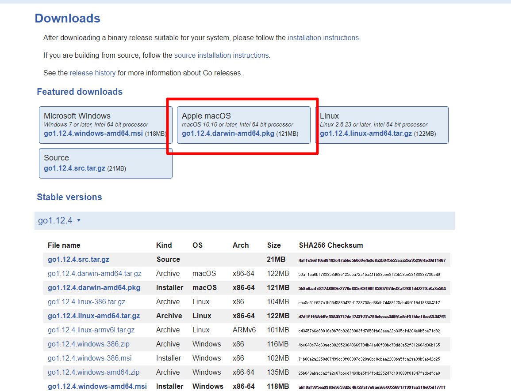
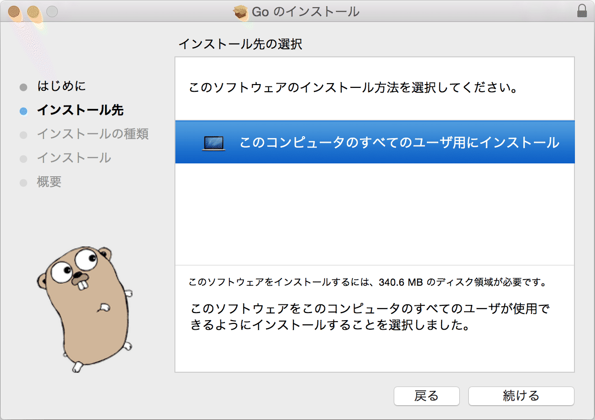
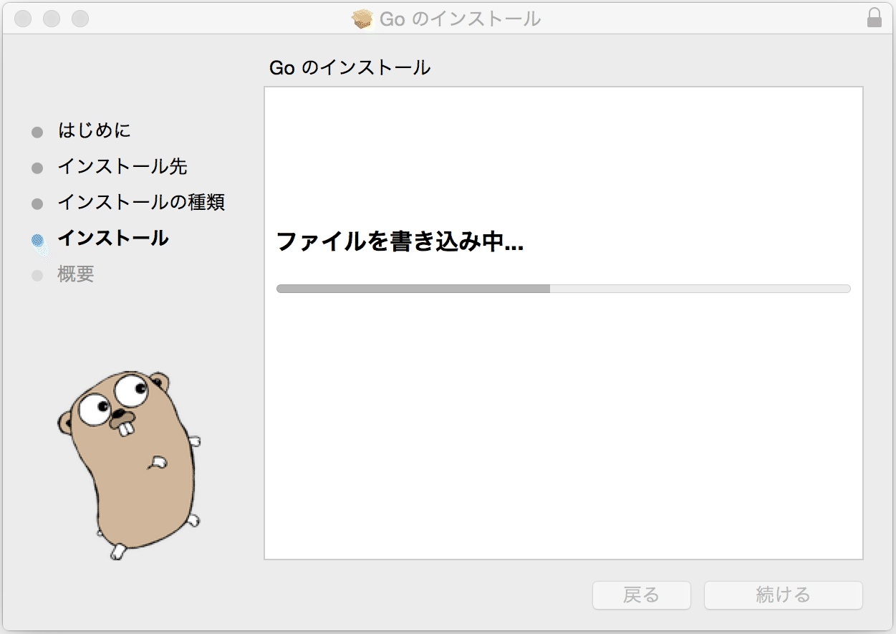
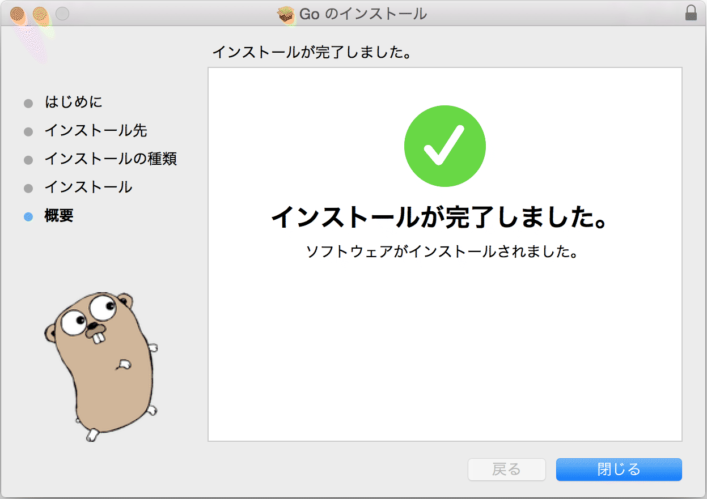
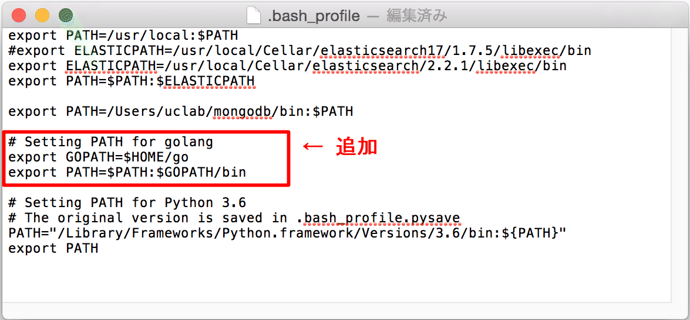

# Goのインストール

 Goはプログラミング言語の1つである。2009年、GoogleでRobert Griesemer、ロブ・パイク、ケン・トンプソンによって設計された。

 Goは、静的型付け、C言語の伝統に則ったコンパイル言語、メモリ安全性（英語版）、ガベージコレクション、構造的型付け（英語版）、CSPスタイルの並行性などの特徴を持つ。Goのコンパイラ、ツール、およびソースコードは、すべてフリーかつオープンソースである。

## ディレクトリ構成

 Go環境の基本的なディレクトリ構成を以下に示す。

| #    | 名称                   | 環境変数名 | パス                  | 備考                     |
| ---- | ---------------------- | ---------- | --------------------- | ------------------------ |
| 1    | Go本体                 | GOROOT     | /usr/local/go         |                          |
| 2    | Go関連モジュール       | GOPATH     | $HOME/go  ※           | リンクモジュール格納先   |
| 3    | Goプロジェクトフォルダ | ー         | $HOME/MyProjects    ※ | ユーザプロジェクト作業先 |

※任意

## Goインストール済み確認

 ターミナルから以下のコマンドを実行し、バージョンが正しく表示されることを確認する。

```
$ go version
```

 バージョン表示で失敗する場合、以下インストールを実施する。

## Goインストール

 Go未インストール時に以下を実施する。

### インストーラの準備

 公式サイト（URL: [https://golang.org/dl/](https://golang.org/dl/)）より該当するMac用インストーラ（.pkg）をダウンロードする。




### インストーラ実行

 ダウンロードしたインストーラを実行する。


-  ［続ける］押下




-  「このコンピュータのすべての･･･」を選択した後、［続ける］押下


-  インストール先を確認し、［インストール］押下


-  パスワード入力後、［ソフトウェアをインストール］押下




-  しばらく待つ




-  ［閉じる］押下


### 再起動とバージョン確認

 インストールに伴い必要な環境変数が定義されるのでMacを再起動後、前項「Goインストール済み確認」に従い、バージョンが正しく表示されることを確認する。

## 環境変数の設定

 $HOME/.bash_profile ファイルを開き、以下のコマンドを追記する。

```sh:.bash_profile
export GOPATH=$HOME/go
export PATH=$PATH:$GOPATH/bin
```

【追記例】



編集後、保存してエディタを閉じる。その後、ターミナルから以下のコマンドを実行し、環境変数の取込み、およびフォルダ作成を行う。

```
$ source ~/.bash_profile
$ mkdir $GOPATH
```

ターミナルから以下のコマンドを実行し、goフォルダが存在していることを確認する。

```
$ ls $HOME
```

