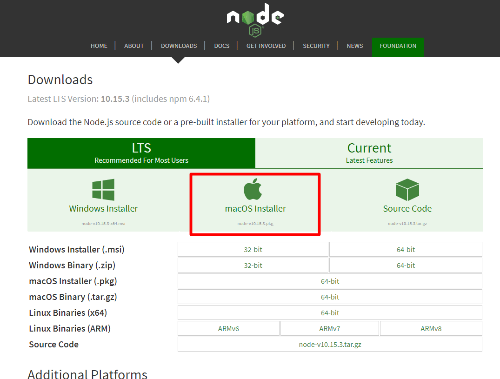
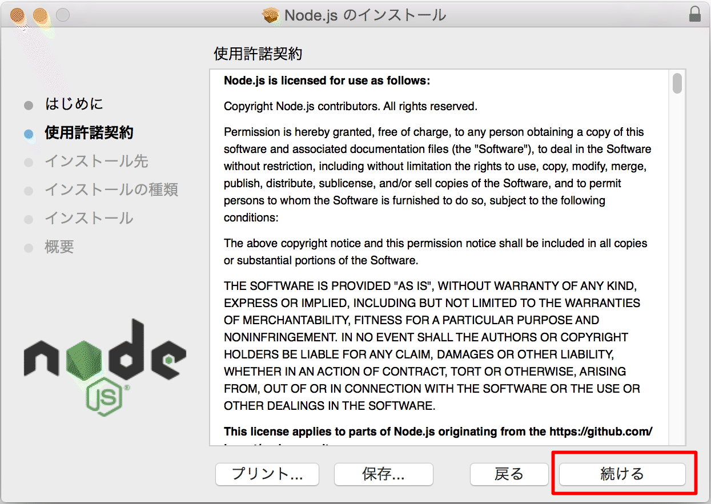
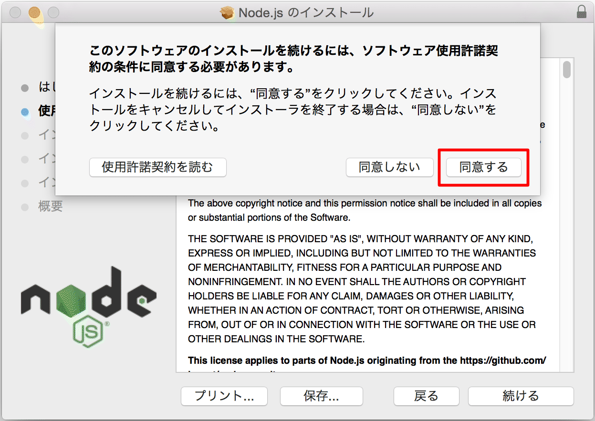
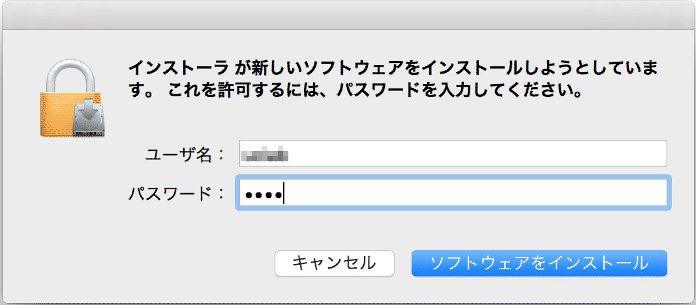
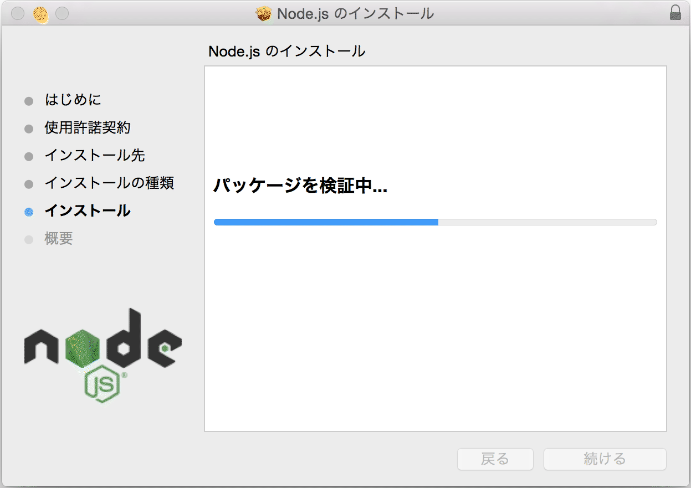

# Node．jsとNPMのインストール

 JavaScriptは本来クライアントサイドで動く言語で、HTMLで書かれたページに動きをつけたりするものである。Node.jsはサーバサイドで動くJavaScriptである。

 NPM(Node Package Manager)とは、Node.jsのパッケージを管理するものである。

## Node.jsとNPMインストール済み確認

 ターミナルから以下のコマンドを実行し、バージョンが正しく表示されることを確認する。

```
$ node --version    ← Node.jsの確認
$ npm --version     ← NPMの確認
```

 バージョン表示で失敗する場合、以下インストールを実施する。

## Node.jsとNPMインストール

 Node.jsとNPM未インストール時に以下を実施する。

### インストーラの準備

 公式サイト（URL: [https://nodejs.org/en/download/](https://nodejs.org/en/download/)）よりMac用インストーラ（.pkg）をダウンロードする。



Bit適合するファイルがダウンロードされる


### インストーラ実行

 ダウンロードしたインストーラを実行する。


-  ［続ける］押下




- ［続ける］押下




- ［同意する］押下


-  ［インストール］押下




-   パスワード入力後、［ソフトウェアをインストール］押下 




-  しばらく待つ


-  ［閉じる］押下


### バージョン確認

前項「Node.jsとNPMインストール済み確認」に従い、バージョンが正しく表示されることを確認する。

