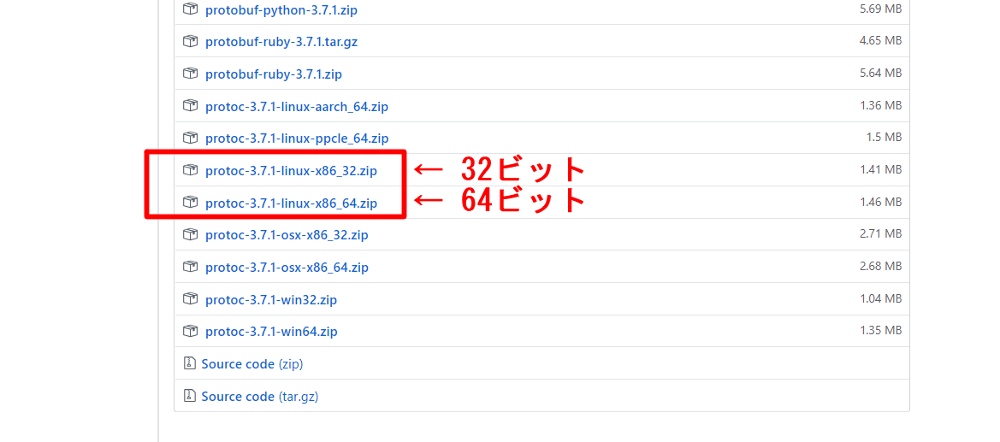

# Protocol Buffersのインストール

 Protocol Buffers（プロトコルバッファー）はインタフェース定義言語 (IDL) で構造を定義する通信や永続化での利用を目的としたシリアライズフォーマットであり、Googleにより開発されている。

 オリジナルのGoogle実装はC++、Java、Pythonによるものであり、フリーソフトウェアとしてオープンソースライセンスで公開されている。

 また、ActionScript・C言語・C#・Clojure・Common Lisp・D言語・Erlang・Go・Haskell・JavaScript・Lua・MATLAB・Mercury・Objective-C・OCaml・Perl・PHP・R言語・Ruby・Scala・.NET Frameworkなどの実装が利用可能である。

## Protocol Buffersインストール済み確認

 ターミナルから以下のコマンドを実行し、バージョンが正しく表示されることを確認する。

```
$ protoc --version
```

 バージョン表示で失敗する場合、以下インストールを実施する。

## Protocol Buffersインストール

 Protocol Buffers未インストール時に以下を実施する。

### モジュールのダウンロード

 公式サイト（URL: [https://github.com/protocolbuffers/protobuf/releases](https://github.com/protocolbuffers/protobuf/releases)）より該当するUbuntu用モジュールをダウンロードする。


 

 ダウンロード後、ターミナルから以下のコマンドを実行し、インストールを実施する。

※以下ダウンロードディレクトリ名、ダウンロードファイル名は一例、「#」はコメント行なので読み跳ばすこと

```
＃ ダウンロード先へカレント変更 (ディレクトリ名は一例)
cd ~/Download

＃ zip解凍（ファイル名は一例）
unzip protoc-3.7.1-linux-x86_64.zip -d protoc3

＃ protocバイナリファイル移動 （移動先 /usr/local/bin/）
sudo mv protoc3/bin/* /usr/local/bin/

＃ protocインクルードファイル移動 （移動先 /usr/local/include/）
sudo mv protoc3/include/* /usr/local/include/

＃ change owner
sudo chown $USER /usr/local/bin/protoc
sudo chown -R $USER /usr/local/include/google
```

前項「Protocol Buffersインストール済み確認」に従い、バージョンが正しく表示されることを確認する。

## Protocol BuffersのGo用プラグインの確認とインストール

 ターミナルから以下のコマンドを実行し、Protocol BuffersのGo用プラグインが存在することを確認する。

```
$ which protoc-gen-go
```

 上記コマンドにてファイルが存在しない場合、ターミナルから以下のコマンドを実行し、Go用プラグインをインストールする。

```
$ go get -u github.com/golang/protobuf/protoc-gen-go
```

 ※処理に数分程度要することがあるので気長に待つ。

 処理終了後、上記whichコマンドを実行し、ファイルが存在することを確認する。

