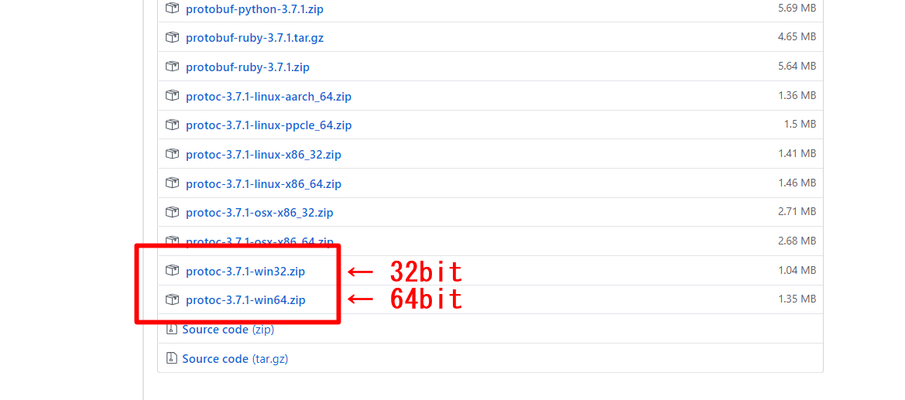
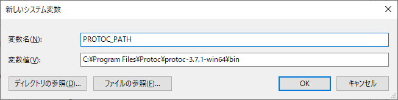
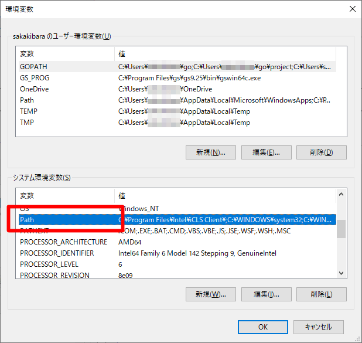

# Protocol Buffersのインストール

 Protocol Buffers（プロトコルバッファー）はインタフェース定義言語 (IDL) で構造を定義する通信や永続化での利用を目的としたシリアライズフォーマットであり、Googleにより開発されている。

 オリジナルのGoogle実装はC++、Java、Pythonによるものであり、フリーソフトウェアとしてオープンソースライセンスで公開されている。

 また、ActionScript・C言語・C#・Clojure・Common Lisp・D言語・Erlang・Go・Haskell・JavaScript・Lua・MATLAB・Mercury・Objective-C・OCaml・Perl・PHP・R言語・Ruby・Scala・.NET Frameworkなどの実装が利用可能である。

## Protocol Buffersインストール済み確認

 コマンドプロンプトから以下のコマンドを実行し、バージョンが正しく表示されることを確認する。

```
> protoc --version
```

 バージョン表示で失敗する場合、以下インストールを実施する。

## Protocol Buffersインストール

 Protocol Buffers未インストール時に以下を実施する。

### モジュールのダウンロード

 公式サイト（URL: [https://github.com/protocolbuffers/protobuf/releases](https://github.com/protocolbuffers/protobuf/releases)）より該当するWindows用モジュールをダウンロードする。





### 圧縮ファイルの展開

 ダウンロードしたzipファイルを任意のフォルダに展開する。

 （例：C:\Program Files\Protoc 下）

 展開したbinフォルダ内の実行ファイル（protoc.exe）のみを「%USERPROFILE%\GO\bin」フォルダ下にコピーする手順もあるが、Synerex Alphaでは、「include」部分もビルド時に必要なため以下の手順とする。

### 環境変数の設定

 ［Win］キー（or ［スタート］） → ｅ ｎ ｖ入力 → システム環境変数の編集
 選択で以下画面を表示、環境変数情報を編集する


-  システム環境変数の［新規］押下




- 変数名：「PROTOC_PATH」
- 変数値：圧縮ファイル展開先￥バージョン￥bin
- ［OK］押下


-  「PROTOC_PATH」項目が追加されていることを確認




-  システム環境変数の「Path」項目をダブルクリック


1. ［新規］押下
2. 「％PROTOC_PATH%」入力
3. ［OK］押下


-  ［OK］押下


### 再起動とバージョン確認

 環境変数を定義したためWindowsを再起動後、前項「Protocol Buffersインストール済み確認」に従い、バージョンが正しく表示されることを確認する。

## Protocol BuffersのGo用プラグインの確認とインストール

 コマンドプロンプトから以下のコマンドを実行し、Protocol BuffersのGo用プラグインが存在することを確認する。

```
> where protoc-gen-go
```

 上記コマンドにてファイルが存在しない場合、コマンドプロンプトから以下のコマンドを実行し、Go用プラグインをインストールする。

```
> go get -u github.com/golang/protobuf/protoc-gen-go
```

 ※処理に数分程度要することがあるので気長に待つ。

 処理終了後、上記whereコマンドを実行し、ファイルが存在することを確認する。

