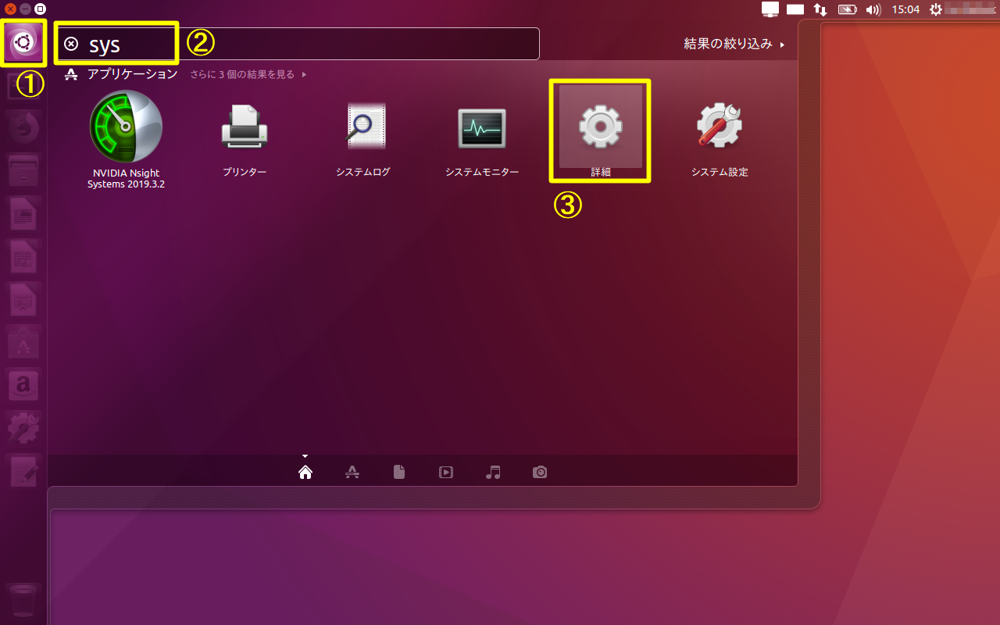
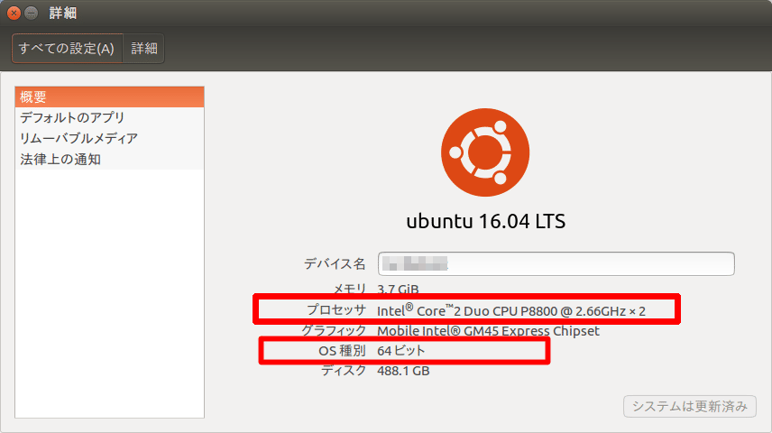

# 事前確認

 作業前に以下を確認する。

## OS情報の確認

 UbuntuのOS情報を確認するため、以下を実行する。



1. 「コンピュータを検索」選択
2. 「sys」入力
3. 「詳細」選択




「プロセッサ」と「OS種別」を把握する。

※本書ではIntel系プロセッサ、64bit版OSを対象としているため、その他の場合（特にARM系プロセッサ）については別途考察が必要となる

## curlコマンドの確認

curlコマンドは、HTTPアクセスをしてコンテンツを取得できるコマンドである。事前にcurlコマンドのインストール済み確認を行う。

ターミナルから以下のコマンドを実行し、バージョンが正しく表示されることを確認する。

```
$ curl --version
```

 バージョン表示で失敗する場合、curlのインストールを実施する。

```
$ sudo apt install curl
```

