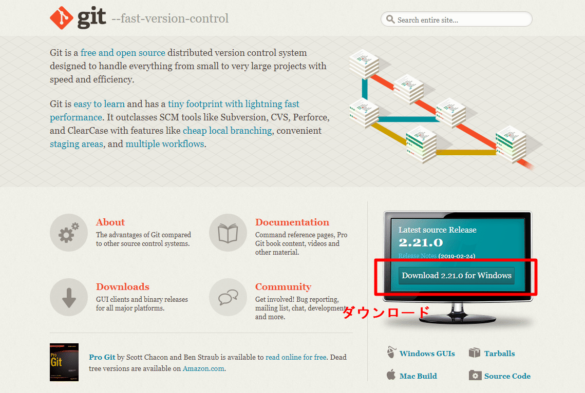

# Gitのインストール

 Git（ギット）は、プログラムのソースコードなどの変更履歴を記録・追跡するための分散型バージョン管理システムである。

 Gitでは、各ユーザのワーキングディレクトリに、全履歴を含んだリポジトリの完全な複製が作られる。したがって、ネットワークにアクセスできないなどの理由で中心リポジトリにアクセスできない環境でも、履歴の調査や変更の記録といったほとんどの作業を行うことができる。

## Gitインストール済み確認

 ［Win］キー（or ［スタート］） → ｃ ｍ ｄ入力 → コマンドプロンプト 
 選択しコマンドプロンプト画面を表示する。

 ※以降、コマンドプロンプト表示方法は省略

 コマンドプロンプトから以下のコマンドを実行し、バージョンが正しく表示されることを確認する。

```
> git --version
```

 バージョン表示で失敗する場合、以下インストールを実施する。

## Gitインストール

 Git未インストール時に以下を実施する。

### インストーラの準備

 公式サイト（URL: [https://git-scm.com/](https://git-scm.com/)）よりインストーラのダウンロードを行う。



### インストーラ実行

 ダウンロードしたインストーラを実行する。


-  ［Next］押下


以降省略。デフォルトのまま、［Next］押下

-  インストール完了後、［Finish］押下


### 再起動とバージョン確認

 インストールに伴い必要な環境変数が定義されるのでWindowsを再起動後、前項「Gitインストール済み確認」に従い、バージョンが正しく表示されることを確認する。

