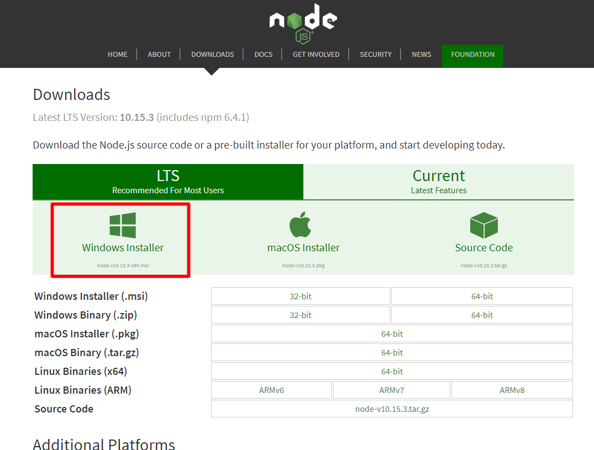
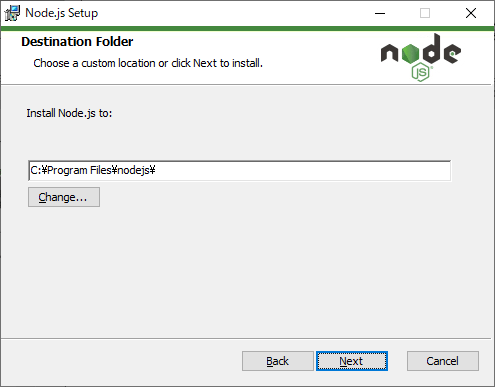
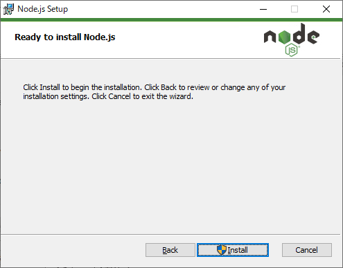

# Node．jsとNPMのインストール

 JavaScriptは本来クライアントサイドで動く言語で、HTMLで書かれたページに動きをつけたりするものである。Node.jsはサーバサイドで動くJavaScriptである。

 NPM(Node Package Manager)とは、Node.jsのパッケージを管理するものである。

## Node.jsとNPMインストール済み確認

 コマンドプロンプトから以下のコマンドを実行し、バージョンが正しく表示されることを確認する。

```
> node --version    ← Node.jsの確認
> npm --version     ← NPMの確認
```

 バージョン表示で失敗する場合、以下インストールを実施する。

## Node.jsとNPMインストール

 Node.jsとNPM未インストール時に以下を実施する。

### インストーラの準備

 公式サイト（URL: [https://nodejs.org/en/download/](https://nodejs.org/en/download/)）よりWindows用インストーラ（.msi）をダウンロードする。



Bit適合するファイルがダウンロードされる


### インストーラ実行

 ダウンロードしたインストーラを実行する。


-  ［Next］押下


-  「Ｉ accept ･･･」にチェックを入れた後、［Next］押下




-  インストール先を確認し、［Next］押下


-  ［Next］押下




-  ［Install］押下


-  しばらく待つ


-  ［Finish］押下


### 再起動とバージョン確認

 インストールに伴い必要な環境変数が定義されるのでWindowsを再起動後、前項「Node.jsとNPMインストール済み確認」に従い、バージョンが正しく表示されることを確認する。

