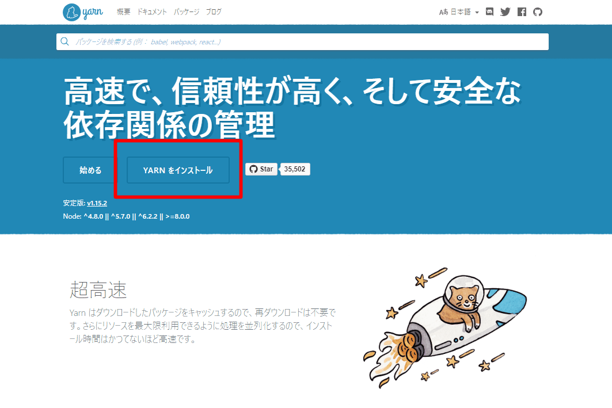
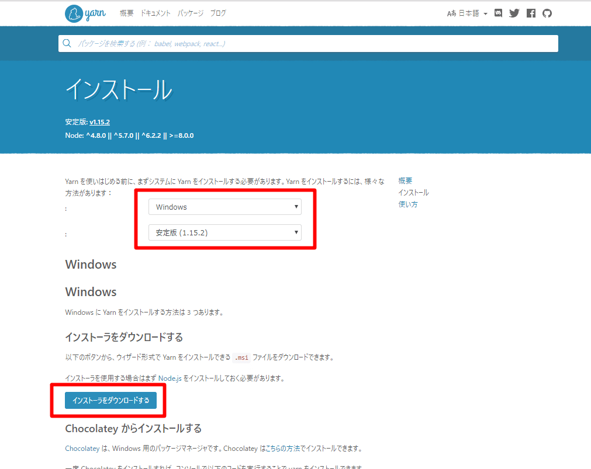
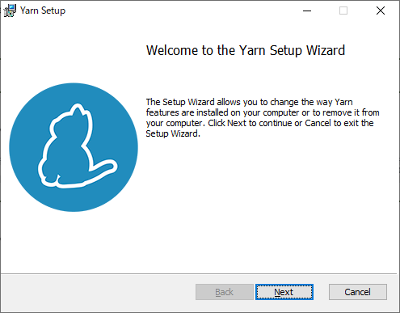
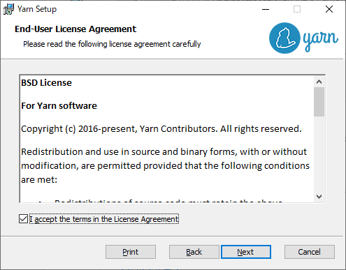
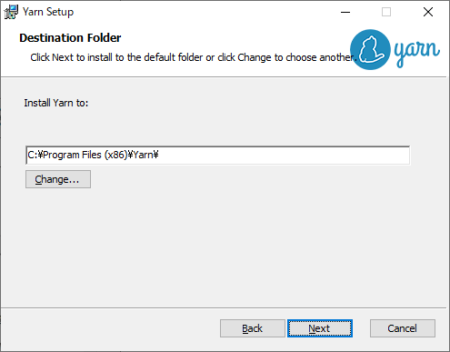
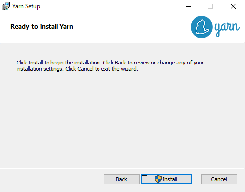
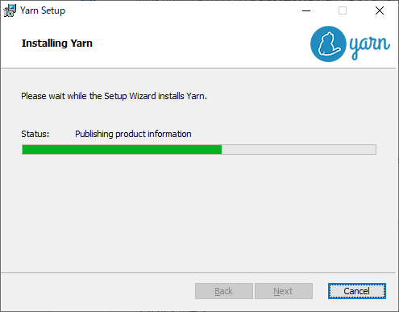
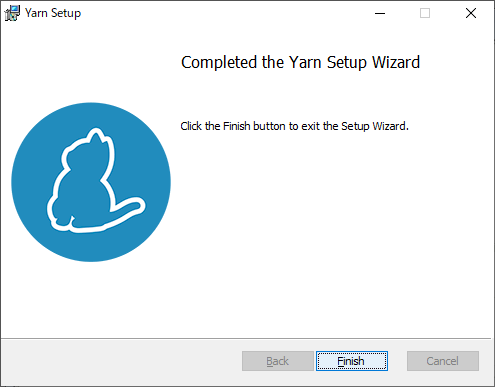

# YARNのインストール

 YARN（Yet Another Resource Negotiator）とは、NPMの高速版パッケージのようなもの

## YARNインストール済み確認

 コマンドプロンプトから以下のコマンドを実行し、バージョンが正しく表示されることを確認する。

```
> yarn --version
```

 バージョン表示で失敗する場合、以下インストールを実施する。

## YARNインストール

 YARN未インストール時に以下を実施する。

### インストーラの準備

 公式サイト（URL: [https://yarnpkg.com/ja/](https://yarnpkg.com/ja/)）よりWindows用インストーラ（.msi）をダウンロードする。



- ［YARNをインストール］押下




- 種類確認後、［インストーラをダウンロードする］押下


### インストーラ実行

 ダウンロードしたインストーラを実行する。



- ［Next］押下




- 「Ｉ accept ･･･」にチェックを入れた後、［Next］押下




- インストール先を確認し、［Next］押下




- ［Install］押下




- しばらく待つ




- ［Finish］押下


### 再起動とバージョン確認

 インストールに伴い必要な環境変数が定義されるのでWindowsを再起動後、前項「YARNインストール済み確認」に従い、バージョンが正しく表示されることを確認する。

